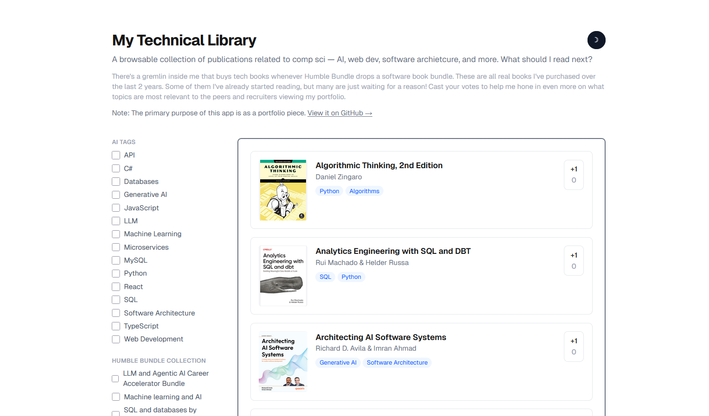

# demos

A portfolio built around one project, where I organize and display a bunch of technical books, 
and where site visitors can provide feedback on which ones tackle skills they're actually
interested in, adding to an aggregate vote count that reflects general interest.

There's a gremlin inside me that collects nonfiction books in general, but I usually let it win
whenever Humble Bundle drops a software bundle. The result is a folder of epubs I legitimately
own and wanted a real interface for. All books in the app are actual books that I own, and all 
votes reflect real site visitors clicking on buttons over time.

The app demonstrates full-stack Next.js, Redis-backed data, a Python and TypeScript processing 
pipeline, and AI engineering as features land. It's also a small piece of public art: anyone
who visits can see the current vote counts, and what topics have the most interest so far.

## [BookShelf](./bookshelf/) — [live demo](https://demos.maejoh.io/)

## What's built

- Browsable library with cover art, metadata, and per-book upvotes
- Redis data store, namespaced by environment (prod / dev / preview)
- Python epub pipeline: OPF extraction → Google Books API enrichment → Redis seed
- AI tagging via Anthropic API: two-pass vocabulary discovery + bulk assignment across the full library

## What's coming

- **LLM features** — title recommendations, job description matching, natural language queries
- **MCP server** — TODO

---

## Development workflow

This repo uses a customized subset of [garrytan/gstack](https://github.com/garrytan/gstack)
skills for Claude Code, committed to `.claude/skills/` and auto-discovered — no install
needed.

| Skill | Source | Customized? |
|---|---|---|
| `/plan-ceo-review` | gstack v1.0.0 | Adapted for TypeScript/Next.js (removed Rails-specific sections) |
| `/plan-eng-review` | gstack v1.0.0 | Adapted for TypeScript/Next.js (removed Rails-specific sections) |
| `/review` | gstack v1.0.0 | Greptile integration removed; checklist path updated |
| `/qa` | gstack v1.0.0 | Template file references removed (files not included) |
| `/ship` | gstack v1.0.0 | **Heavily customized** — Rails/evals/Greptile/VERSION/CHANGELOG automation removed; replaced with `npm run build` + `npm run lint` per subfolder |
| `review/checklist.md` | — | **Written from scratch** — portfolio-specific criteria (secrets, build integrity, live+linkable+self-explanatory) |
