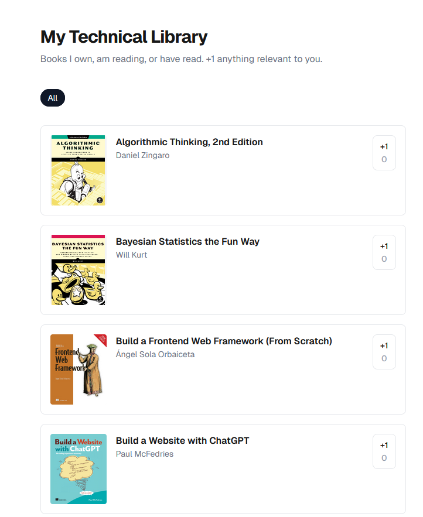

# BookShelf — [live demo](https://redis-roadmap-seven-inky.vercel.app/)

A personal technical library built from epub files, with API-enriched details,
cover art, and site-visitor vote counts of what books look interesting.

For the motivation and context behind this project, see the [repo README](../README.md).
This document covers the technical implementation.



## What it does

- Browsable library with cover art, titles, and authors
- Per-book upvote counts, persistent and visible to all visitors
- Tag-based filtering by Humble Bundle and AI-generated topic tags

## How it's built

**Frontend:** Next.js (App Router) + TypeScript + Tailwind CSS v4, deployed on Vercel.

**Data:** Book metadata and vote counts live in [Upstash Redis](https://upstash.com/),
namespaced by environment so that dev, preview, and prod stay isolated.

**Book pipeline:** A Python pipeline walks a folder of epub files, pulls metadata from each
file's embedded OPF manifest, enriches it via the Google Books API, and extracts cover images
directly from the epub zip. A second script calls the Anthropic API in two passes to generate
a normalized tag vocabulary across the whole library and assign tags per book. A TypeScript
seed script writes the results to Redis. Cover images are served as static assets — no external
image CDN at runtime.

## Stack

- Next.js 16 / React 19
- TypeScript
- Tailwind CSS v4
- Upstash Redis
- Python (data pipeline, local only)

## Running locally

```env
# .env.local
UPSTASH_REDIS_REST_URL=...
UPSTASH_REDIS_REST_TOKEN=...
BOOKS_DIR="..."            # root folder containing epub bundle subfolders
GOOGLE_BOOKS_API_KEY=...   # for metadata enrichment
ANTHROPIC_API_KEY=...      # for AI tagging
```

```bash
npm install
npm run dev
```

The data pipeline runs locally. See `CLAUDE.md` for pipeline commands and Redis seeding options.
